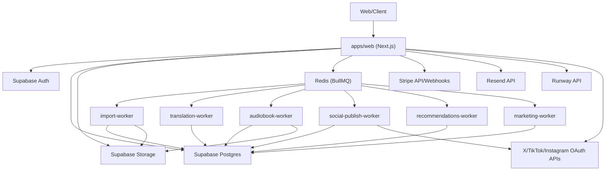

# ARCHITECTURE_MAP

## TLDR
1. Systemets centrum är `apps/web` (Next.js app + API + queue producers).
2. Data går primärt till Supabase (Auth, Postgres, Storage).
3. Redis används som kö-backplane för BullMQ workers.
4. Sju worker-processer finns i kod (import, translation, audiobook, social, recommendations, marketing, notifications).
5. Kanonisk worker-runtime är `apps/web/scripts/start-workers.ts` via `npm run start-workers`; per-worker scripts finns kvar för fokuserad lokal felsökning.
6. Betalning går via Stripe; email via Resend; video via Runway.
7. Translation är ett lokalt provider-flöde (Opus MT) med starkt env-beroende.
8. Databasmigrationer har en kanonisk källa i `apps/web/supabase/migrations`; legacy-spåret i `packages/db` är arkiverat.

## Översiktsdiagram

## Appar Och Paket

### Appar
| Komponent | Path | Huvudansvar |
|---|---|---|
| Web app | `apps/web` | Frontend, API routes, queue producers, worker scripts |
| Worker app | `apps/worker` | Kompatibilitetsshim som vidarebefordrar till kanonisk runtime i `apps/web/scripts/start-workers.ts` |

### Delade paket
| Paket | Path | Huvudansvar |
|---|---|---|
| Config | `packages/config` | Delad ESLint/TSConfig |
| Shared | `packages/shared` | Contracts/schemas/constants |
| UI | `packages/ui` | Delat UI-paket (stub idag) |
| DB | `packages/db` | Legacy migrations + db-stub |

## Databaser Och Storage

### Primära datakällor
| Resurs | Typ | Kommentar |
|---|---|---|
| Supabase Postgres | Databas | Primär runtime-databas |
| Supabase Auth | Identitet | Session och user context |
| Supabase Storage | Objektlagring | Covers/audio/content assets/importfiler |
| Redis | Queue state | BullMQ jobs, retries, dedupe state |

### Migrationskällor
| Källa | Path | Status |
|---|---|---|
| Kanonisk | `apps/web/supabase/migrations` | Alla migrationer, konsoliderad 2026-03-04 |
| Arkiverad | `packages/db/supabase/migrations_archived` | Referens, ej aktiv |

### Storage buckets i migrationer
- `book_covers`
- `audiobooks`
- `content-assets`

### Storage bucket i runtimekod
- `book-imports` (används av import-flödet)

## Queue Och Worker Karta
| Queue | Producer (API/lib) | Worker | Output/tabeller |
|---|---|---|---|
| `book-import-extract` | import routes + scoped import lib | `scripts/import-worker.ts` | `book_imports`, `books`, `book_versions`, `chapters` |
| `book-translation` | translate route + auto-enqueue i import worker | `scripts/translation-worker.ts` | `book_versions`, `chapters` |
| `audiobook-generation` | audiobook generate route | `scripts/audiobook-worker.ts` | `ai_jobs`, `audiobook_assets`, `chapter_audio_cache`, storage |
| `social-publish` | social publish route | `scripts/social-publish-worker.ts` | `ai_jobs`, `marketing_campaigns` |
| `marketing-campaign` | marketing schedule route | `scripts/marketing-worker.ts` | `marketing_campaigns` |
| `recommendations` | recommendations queue + intern scheduler | `scripts/recommendations-worker.ts` | `recommendations` |
| `notifications` | notification routes/jobs | `scripts/notifications-worker.ts` | notifications-relaterade side effects |

## Route Domäner (Översikt)
| Domän | Frontend routes | API routes |
|---|---|---|
| Auth | `/author/*auth`, `/reader/*auth`, `/auth/reset-password` | `/api/auth/active-role`, `/api/author-applications`, `/api/admin/author-applications`, `/auth/callback` |
| Author app | `/author/home`, `/author/books`, `/author/publish`, `/author/stats`, `/author/marketing` | `/api/author/stats*`, `/api/books/[id]/*` |
| Reader app | `/reader/home`, `/reader/discover`, `/reader/books/[id]`, `/reader/read/[chapterId]` | bookmarks, comments, follows, reviews, clubs, polls, notifications |
| Billing | account billing pages | `/api/billing/*`, `/api/stripe/webhook`, `/api/books/[id]/purchase/checkout`, `/api/donations/checkout`, `/api/credits/*` |
| Import/Translation/Audiobook | author book workflows | `/api/books/import*`, `/api/books/[id]/import`, `/api/books/[id]/translate*`, `/api/books/[id]/audiobook/*` |

## Tredjepart Och Integrationspunkter
| Tjänst | Funktion | Nycklar |
|---|---|---|
| Stripe | Checkout, subscriptions, webhook processing | `STRIPE_SECRET_KEY`, `STRIPE_WEBHOOK_SECRET`, `PRICE_PLUS`, `PRICE_PRO`, `STRIPE_*_URL` |
| Resend | Waitlist- och newsletter-utskick | `RESEND_API_KEY`, `RESEND_FROM_EMAIL` |
| Runway | Text-till-video | `RUNWAYML_API_SECRET` |
| X/TikTok/Instagram | OAuth connect + publish | `X_*`, `TIKTOK_*`, `INSTAGRAM_*` |
| Supabase | Auth, DB, Storage | `NEXT_PUBLIC_SUPABASE_URL`, `NEXT_PUBLIC_SUPABASE_ANON_KEY`, `SUPABASE_URL`, `SUPABASE_SERVICE_ROLE_KEY` |
| Redis | Queue transport | `REDIS_URL` |
| Opus MT (lokal) | Translation provider | `OPUSMT_PYTHON`, `OPUSMT_MODELS_DIR` |

## Säkerhetsgränser
- API auth bygger på Supabase session från server client (`createClient`).
- Privilegierade operationer går via service-role client (`createAdminClient`).
- Author-gating använder DB-kontroller (`profiles.role` + `author_applications`) i middleware + route guards.
- Admin-endpoints kräver en autentiserad Supabase-session där `profiles.role = 'admin'`.
- Operativa health-endpoints kräver admin-session eller `x-ops-health-token` / bearer-token via `OPS_HEALTH_TOKEN` eller `HEALTHCHECK_TOKEN`.
- Social OAuth state signeras och valideras med `SOCIAL_OAUTH_STATE_SECRET`.
- Social tokens krypteras med `SOCIAL_TOKEN_KEY`.

## Kända Arkitekturluckor
- [ ] `apps/worker` och `combined-worker.ts` finns kvar som kompatibilitetsvägar, men äger inte längre worker-runtime.
- [ ] Per-worker scripts och den unifierade runtime:n behöver hållas funktionsparallella tills gamla startvägar kan tas bort helt.
