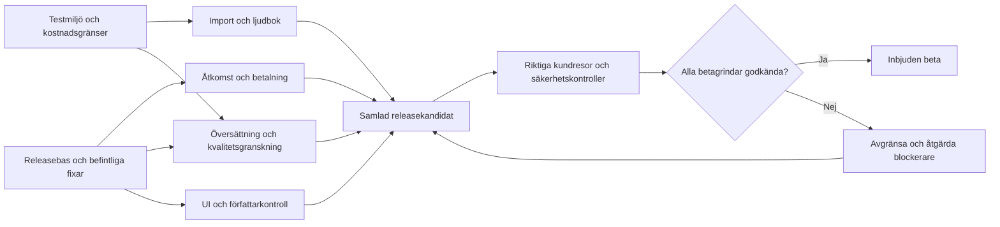

# Verkli — plan för inbjuden författarbeta och lanseringsveckan

Beslutsunderlag och arbetsplan, 14 september 2026. Ägare: Svea (produkt), Codex (integration och leverans). Detta dokument finns på `codex/launch-command-20260914`, med bas `26d02239`. Planeringen har inte ändrat eller driftsatt produktkod.

**Beslutat av Svea:** inbjuden författarbeta först; **5 000 SEK i planerad extra API-budget för veckan**. Budgetsvaret är planering, inte ett köp eller ett generellt godkännande att starta betalda tester. Övriga omfattningar och trösklar nedan är rekommendationer.

**Mål:** intern repetition och, om grindarna passerar, en första liten beta inom 48 timmar från start. Vid start 14 september blir måldagen 16 september. Befintligt mål för nästa lanseringsbeslut är söndag 20 september. Datumen är mål med villkor; ofärdiga kontroller får aldrig redovisas som godkända för att hålla ett datum.

**Aktuellt 15 september:** R0 är committad och pushad på granskningsgrenen `origin/codex/release-integration-20260914` vid `e9544c19bbd23601070aa9bbbb67ce12b5169bd6`. `origin/platform` är fortfarande `26d02239cf57cac050ada410e197692878145270` efter färsk fetch; dagens produktions-runtime-SHA är inte verifierad. R0 ska inte startas om. F1 är säkrat i `3372782c`, S1-GATE i `f9e53d8c`, S1-STORAGE i `717a98ea` och AI-kvalitetskedjan i WIP-checkpoint `74aa9075`. Ingen av dessa fyra är integrerad eller driftsatt. [Status och nästa uppdrag den 15 september](2026-09-15-launch-status.md) ersätter tidigare statusuppgifter nedan.

**Historiska R0-bevis från 14 september:** verifieraren redovisar **1 817 passerade unittester på baspaketet**, **1 834 efter mejlfixen** och **176 filer / 1 840 tester på fryst P1 + SSR-kandidat**; antal summeras inte. Basens launch-E2E gav **8/10**: författarens H1 och pending-access-notisen väntade på cirka tio sekunders kall klienthydrering. En avgränsad SSR-fix är fryst och oberoende granskad; implementationens sex SSR-regressioner gick från tre fel till sex pass, och 18 SSR/mobil/metadatafall passerade. **Slutkandidaten har PASS på lint, TypeScript, normalt Turbopack-produktionsbygge, oförändrad launch-E2E 10/10 utan skips/retries/timeoutändringar samt 3/3 browserprov utan JavaScript.** Sista kontrollen avslutades 15:49:48 UTC med oförändrat källträd. Lokal produktionspreview användes på `http://127.0.0.1:3031`; dagens processstatus är inte verifierad; riktig inloggning, köp/inbox och livekonfiguration ingår inte i denna isolerade gate. Se [R0-verifieringen](/Users/admin/verkli-web/.claude/worktrees/release-integration-20260914/docs/qa/2026-09-14-r0-verification.md) och [oberoende review](/Users/admin/verkli-web/.claude/worktrees/release-integration-20260914/docs/qa/2026-09-14-r0-review.md).

**Q0:s förberedelse är klar**, men miljön för senare autentiserade/integrerade kundresor, konto B/läsare och leveransinbox är inte slutligt fastställda. Konto A:s befintliga tillåtna flöde är inventerat. [Q0-underlaget](2026-09-14-q0-test-preparation.md) skiljer detta från R0:s isolerade offentliga kontroll. [AI-01-handoff](2026-09-14-ai-integration-handoff.md) är klart för ett separat tvåfilspaket efter verifierad R0; AI-02:s ersättningsflöde är blockerat av ett **P0 som kan skriva över nyare måltext**. Det blockerar inte R0. Claude/S1 har nu lämnat sin säkerhetsgranskning och kriterier. Codex äger åtgärderna; Claude är read-only granskare. Övriga externa verktygs aktuella sessioner är inte verifierade.

## 1. Vad vi faktiskt har

Granskningen jämförde kod, tidigare QA-bevis, grenarnas historik och en aktuell livekontroll. Tre specialister granskade AI, backend/säkerhet respektive produkt/QA. Detta var en riktad inventering, inte en fullständig ny QA eller penetrationstest.

| Område | Belagt läge 14 september | Betydelse för veckan |
|---|---|---|
| Webb och design | Release `26d02239` innehåller det nya bokflödet och assistentens responsiva layout. Föregående `1293e720` innehåller worker-runtimefixen för Node 22. | Behåll designen och driftsfixen när andra paket integreras. |
| Betalningsåtkomst | Fyra QA-/säkerhetscommits på `codex/launch-qa-20260910` saknas i den releasen. Ett aktuellt osignerat POST till `/api/stripe/webhook` gav **403, Beta access required**. | **P0:** rätt middlewarefix måste ut live. En korrekt osignerad begäran ska nå signaturkontrollen och nekas där, inte av betaspärren. |
| E-boksleverans | Nuvarande release saknar samma grens förbättringar för återvändningslänk i mejl och kontroll av aktuell betalning efter refund/dispute. | Integrera och testa leverans och åtkomst; ett historiskt betalt köp är inte tillräckligt för en ny nedladdningslänk. |
| Översättning | Lokal kvalitetskedja: författarprofil → översättning → två granskarroller → högst en riktad korrigering → omgranskning. Rapport, textfingeravtryck och budgetreservation finns lokalt. | Granska och integrera befintligt arbete. Bygg inte en konkurrerande kedja. |
| Faktiska AI-leverantörer | Granskad kod använder Anthropic för svenska översättningspar och skrivstöd, Riva för andra stödda par, ElevenLabs för ljud och fal.ai för omslag. | Tillgång till ChatGPT API innebär inte att alla dessa produktflöden redan använder OpenAI. Eventuella modellbyten ska avgöras med kvalitet/kostnad/latens-test, inte blandas in som ett generellt byte före betan. |
| Kvalitetsbevis för AI | Tio korta syntetiska översättningsfall, fem med inlagda fel, har testats. Den reviderade rubriken upptäckte 5/5 blockerande fel och blockerade 0/5 referenser. | Lovande utvecklingsbevis, **inte** bevis för litterär bokkvalitet. Fallen användes vid förbättring av rubriken; ett separat testmaterial och mänsklig granskning återstår. |
| Skrivstöd | Befintliga leverantörsanrop, kapitelkontext och fallback finns. Annat aktivt uppdrag bygger korrektur, kapitelanalys och godkänn/avvisa med skydd mot att skriva över nyare text. | Författarkontroll och ärliga fel-/fallbacklägen före fler AI-knappar. |
| Import och ljudbok | Köer, workers, ElevenLabs, lagring och spelare finns. Runtime/start har kontrollerats; återställd import har också körts via lokal worker mot produktionsdatabas. | Det är inte ett färskt bevis för hela produktionskedjan. Import och verklig ljudgenerering måste köras genom rätt kö och verifieras till sparad/läsbar/lyssningsbar bok. |
| Samtidigt utvecklingsarbete | Root har omfattande pågående ändringar. Uppdraget **Sammanställ plattformsplanen** äger korrektur, kampanjutkast och read-only utbetalningsöversikt. | Arbetet är samordnat med det uppdraget. Ingen masscommit av root och ingen dubbel implementation. |
| QA | Tidigare UI-prov täcker omslag/assistent på 320–1920 px. CI kör lint, TypeScript, produktionsbygge och unit-tester. | UI-fixtures och testantal bevisar inte verklig inloggning, betalning, sparning eller AI-generering. CI saknar fullständig verifiering av kundresorna. |

Vi redovisar varje funktion separat som **byggd**, **lokalt verifierad**, **verifierad med riktig tjänst**, **integrerad** och **verifierad live**. Testantal från olika grenar får inte läggas ihop. Hela plattformen är ännu inte belagt lanseringsklar.

**Senare överlämning samma dag:** uppdraget *Sammanställ plattformsplanen* har nu lämnat E1/X1 för integrationsgranskning. Dess leveransrapport anger 1 906 passerade tester, lint/typkontroll/produktionsbygge, Chrome 390/1200 px, riktiga syntetiska AI-prov och faktisk korrektursparning/ångra via localhost och Supabase på ett befintligt E2E-kapitel. Originaltexten uppges återställd. Payoutdata har verifierats med simulerade Stripe-svar, inte faktisk utbetalning. Ingen commit eller deploy har gjorts. Huvuduppdraget har läst rapporten men inte själv upprepat dessa kontroller. Källa: `docs/plans/2026-09-14-editorial-campaign-payout-delivery.md` i root. Denna överlämning ersätter tabellens tidigare "pågående" för dessa paket; den ersätter inte kandidatens gemensamma QA. Kostnaden för det andra uppdragets providerprov är inte redovisad här och ska stämmas av separat mot veckans budget.

### Källor i projektet — läs dessa före nya lösningar

Alla sökvägar är relativa till angiven checkout; radnummer kan flytta sig under pågående arbete.

| Källa | Checkout | Varför den styr planen |
|---|---|---|
| `docs/plan/launch-plan-2026-09.md` | Bas `26d02239` | Befintligt datum 20 september. Inledande driftstatus är historisk; gammal omfattning lade översättning senare och ersätts här av användarens nya AI-prioritet. |
| `DESIGN.md` | Bas | Godkänt designspråk, komponenter, rörelse och tillgänglighet. Ingen ny designriktning behövs. |
| `docs/qa/book-workflow-2026-09-14.md` | Bas | Exakt vad senaste UI-kontrollen täckte, och vilka riktiga flöden den inte verifierade. |
| `apps/web/middleware.ts`; `src/app/api/stripe/webhook/route.ts` under `apps/web` | Bas | Betaspärr respektive fortsatt obligatorisk signaturverifiering. |
| `apps/web/src/lib/orders/ta-for-er-download.ts`; `apps/web/src/app/api/stripe/webhook/stripeWebhook.handlers.ts` | Bas + QA-gren | E-boksåtkomst och leveransgapet. |
| `apps/web/src/lib/translation-pairs.ts`; `apps/web/src/lib/ai/providers/server.ts` | Bas + AI-checkout | Svensk översättningspreview och worker väljer inte konsekvent samma stöd. Den lokala fixen kan lyftas separat. |
| `apps/web/src/lib/ai/translation-quality/{pipeline,anthropic,evaluation}.ts`; `apps/web/src/lib/translation-quality-budget.ts` | AI-checkout | Befintlig granskning, evidens, begränsad korrigering och kostnadsreservation. |
| `docs/qa/ai-readiness-2026-09-14.md`; `docs/qa/translation-quality-2026-09-14.md` | AI-checkout | AI-resultatens faktiska omfattning, kvarstående testluckor och sparningsbegränsningar. |
| `apps/web/scripts/{import-worker,audiobook-worker,translation-worker}.ts`; `apps/web/src/lib/workers/budget.ts` | Respektive kandidat | Köhantering, ägarskap, återförsök och befintlig atomisk Redis-reservation. |
| `apps/web/src/app/api/health/workers/route.ts` | Bas | HTTP 200 kan förekomma trots saknade worker-heartbeats; statuskroppen måste tolkas. |
| `.github/workflows/ci.yml`; `apps/web/scripts/qa-beta.mjs` | Bas | Aktuella kontroller. `qa:beta` har 11 steg, och vissa kan hoppa över kontroll vid saknade uppgifter. |
| `apps/web/playwright.launch.config.ts`; `docs/plans/2026-09-10-launch-readiness-qa.md` | QA-gren, ännu inte bas | Tester mot produktionsbygge och dokumenterade luckor för inloggade kundresor. |
| `apps/web/e2e/ai-features.authed.spec.ts`; `apps/web/scripts/e2e-fixture.ts` | Root, inventeras före körning | Vissa tester anropar riktig LLM; fixtureverktyget kan ändra konton/lösenord eller radera testdata. Det är inte en ofarlig bootstrap mot produktion. |
| `docs/plans/2026-09-14-checklist-delivery.md` | Root, pågående | Annat uppdrags ägarskap och deltester. Ingen automatiskt godkänd release. |
| `docs/qa/2026-09-14-r0-{verification,review}.md` | R0-worktree | Faktisk kandidat, successiva testresultat, stängd mejl-P1, SSR-granskning och återstående slut-QA. |
| `2026-09-14-q0-test-preparation.md`; `2026-09-14-ai-integration-handoff.md` | Detta dokuments katalog | Klar Q0-inventering, exakt AI-01-paket och AI-02:s måltextsrace med minsta regression. |

## 2. Vad första betan ska lova

Rekommenderad första grupp: **3–5 personligen inbjudna författare**, efter intern repetition och Sveas klartecken att börja bjuda in. Ingen extern kontakt görs i planeringspasset; det befintliga beslutet att vänta med Hannes gäller.

En författare ska kunna:

1. Ta emot sin inbjudan och logga in i rätt arbetsyta.
2. Importera ett manus, redigera, byta kapitel och ladda om utan tyst textförlust.
3. Använda skrivförslag med originalet bevarat och godkänna dem själv.
4. Översätta inom en **verifierad språk- och längdgräns**, se kvalitetsrapporten och granska resultatet. Börja med sv→en; lägg till en→sv först när samma kontroller passerar.
5. Skapa och lyssna på ett begränsat ljudboksprov med en verifierad standardröst, se status och hantera fel. Hela böcker kräver ett separat längre genomlopp.
6. Välja och spara omslag samt prova sin bok i läsarflödet. Offentlig publicering kräver författarens handling och passerad publiceringskontroll.

Gränser för kapitel, längd, språk, röster och credits ska visas före start. De fastställs i AI-02 med riktiga kostnadsmätningar; inga påhittade tal skrivs in i gränssnittet nu. Betaförfattaren ska inte betala för ett flöde som bara är demonstrerat med mocks. Befintlig bokförsäljning och dess betalnings-/leveransfel måste ändå åtgärdas.

**Utanför första betans kritiska väg:** nya mobilappar, röstkloning, video, automatisk social publicering, alla språk, ny designriktning och komplett royaltyautomation. Pågående kampanj-/payoutarbete får levereras som separata granskade paket; det ska inte försena ett säkert manusflöde. Royaltyfördelningen 25/30 procent är olöst i annat uppdrag; inga pengaflöden ändras på antagande.

## 3. Teamet och verktygen

Rollerna är ansvar, inte åtta personer som måste skriva samtidigt. Börja med högst **fyra samtidiga koduppdrag totalt över verktygen**, och låt övriga roller granska. Räkna in redan aktiva uppdrag och deras underagenter. Kör ett tungt buildjobb och en gemensam browser-QA åt gången. Justera efter uppmätt minne och svarstid.

| Roll | Rekommenderat verktyg | Ansvar och leverans |
|---|---|---|
| Releaseansvarig / senior staff engineer | **Codex, detta huvuduppdrag** | Prioritering, beroenden, filägarskap, samlad releasekandidat, integration, driftsättning och återställningsplan. Enda integrationsägaren. |
| Backendutvecklare | **Codex i eget worktree** | Inloggning, betalningsåtkomst, import/köer och leverans. Små testade paket. |
| AI-arkitekt | **Codex på befintligt AI-arbete; Claude som separat granskare** | Kontext, granskarroller, sparningsgarantier, kostnad, utvärdering och tydliga kvalitetsbeslut. |
| Frontendutvecklare | **Cursor i tilldelat worktree** | Verkliga UI-tillstånd, progress/fel/återförsök, mobil, assistent och integration av API-kontrakt. |
| Senior mjukvarugranskare | **Claude Code** | Oberoende diffgranskning av konkurrerande sparning, idempotens, integrationsrisker och felvägar. Fynd med kodbevis, inte en generell godkännandestämpel. |
| CSO | **Separat Claude- eller Codex-granskaruppdrag** | Tenantisolering, roller, betalvägg, privata filer, hemligheter, promptgränser och kostnadsmissbruk. Read-only tills ett fixpaket tilldelas. |
| QA-ledare | **Codex/browser samt mänskliga enhetstester** | Reproducerbara kundresor, negativa fall, bevis per kandidat-SHA, oberoende omtest efter fix. |
| Designer | **Cursor + designgranskning** | Konsekvent `DESIGN.md`, tydlighet, tangentbord, kontrast, laddning/tomt/fel och responsivitet. Ingen omdesign av hela produkten. |
| Leveranskoordinator | **Grok Bot, valfri** | Uppdragslista, beroenden, sammanfatta PR-/testbevis, förbereda nästa överlämning. Inga egna produktionsreleaser eller parallella ändringar i någon annans filer. |
| Produktägare | **Svea** | Omfattning, kohort, godkända testkonton och testmaterial, språkbedömning, 20-minuters genomgångar och slutligt lanseringsbeslut. |

**Varför denna fördelning:** vi har redan repo, releaser och aktivt arbete i Codex. Att byta hela styrningen till en ny orkestreringsplattform skulle lägga ännu en integration på kritiska vägen. Claude ger en andra granskning; Cursor passar avgränsat UI-arbete. Grok är användbart för samordning när överlämningarna fungerar.

Grok Bot kan låta flera bots samarbeta på en beständig molndator, men de delar filer, sessioner och inloggningar. Det ger inte automatiskt åtkomst till denna Macs localhost eller befintliga CLI-sessioner. Börja med ett pilotuppdrag: sammanfatta tre tilldelade tickets från åtkomliga Git-/PR-bevis och identifiera deras verkliga blockerare. [xAI: overview](https://docs.x.ai/grok-bot/overview), [collaboration](https://docs.x.ai/grok-bot/chat-and-collaboration).

Claude stöder isolerade worktrees för underagenter; Cursor-underagenter delar normalt checkout om isolering inte väljs. Ange alltid rätt bascommit och tilldelat worktree. [Claude: subagents](https://code.claude.com/docs/en/sub-agents), [Cursor: subagents](https://cursor.com/docs/subagents).

Den här datorn har verifierat M5 Pro, 24 GB RAM och 18 CPU-kärnor. Claude Code, Codex CLI, Cursor och Grok Bot finns installerade. Lokal kapacitet hjälper bygg/test men gör inte molnmodellernas kvoter obegränsade. Claude-användning delas mellan bland annat chatt och Claude Code; fler agenter skapar inte fler abonnemangskvoter. [Claude: usage limits](https://support.claude.com/en/articles/11647753-how-do-usage-and-length-limits-work). Codex visade 94 procent kvar av veckofönstret vid inventeringen; femtimmarsfönstret saknades i svaret. Övriga verktygs återstående kvoter är inte verifierade. Det är en ögonblicksbild, inte en kapacitetsgaranti för veckan.

## 4. Tidsplan och beroenden

T0 är när genomförandet startar med tillgänglig integrationsägare. Tiderna är planeringsintervall inklusive fokuserad kontroll, inte löften om modellernas hastighet. 20 september är sex kalenderdagar efter 14 september; det är inte sju extra utvecklingsdagar.

R0:s lokala gate är verifierad; Q0:s inventering är levererad. Tabellen nedan behåller planeringsintervallen. Aktuellt bevisläge ovan och [uppdragsregistret](2026-09-14-launch-task-pack.md) styr status, inte en passerad klocktid.

| När | Leverans | Ansvar | Grind |
|---|---|---|---|
| **T0–4 h, 14 sep** | R0: identifiera aktuell produktions-SHA, paketera befintligt arbete och integrera de fyra saknade QA-commitarna separat. Q0: välj säker testmiljö, skilj kostnadsfria och betalda tester. | Release, backend, QA | En definierad kandidat och uppdragsägare. Ingen blind root-push. |
| **4–16 h, 14–15 sep** | B1 betalning/åtkomst; B2 import/worker; AI-01 previewparitet och AI-02 kvalitetsintegration. Befintligt korrekturpaket E1 lämnas över. Designer granskar utan kodkollision. | Fyra avgränsade koduppdrag; oberoende review | Små granskade commits och feltester. Kostnadskontroll före riktiga AI-körningar. |
| **16–32 h, 15 sep** | Frigör kodplatser till A1 verkligt ljudprov, F1 UI-tillstånd och AI-03 kvalitet. P1 förbereder läsar-/åtkomstprov och slutför dem när A1:s riktiga ljud finns. | Audio, frontend, AI/QA och läsare | A1 → P1 är ett obligatoriskt beroende. Om första vågen inte frigör kapacitet i tid flyttas betan; slut-QA komprimeras inte bort. |
| **32–48 h, 15–16 sep** | Q1 samlad repetition: inbjudan → import → edit/reload → översättning → kort ljudprov → läsare. S1/O1 slutför isolering, drift och återställning. Tid reserveras för felrättning och omtest. | QA, backend, AI, CSO | Beta endast när G1–G6 nedan är gröna. Annars intern testning och exakt lista över kvarvarande blockerare. |
| **16–17 sep** | Utökat låst språkunderlag, längre kapitel, kostnad/latens, ljudkontroller, samtidiga redigeringar och verkliga enheter. | AI, senior, QA | Reproducerbara kvalitetsresultat och åtgärdade dataintegritetsfel. |
| **18 sep** | Funktionsfrysning för veckans release. Integrera endast färdiga paket, kör full kandidat-QA och CSO-granskning; öva återställning. | Release, QA, CSO | Inga öppna P0/P1 inom omfattningen. Nya önskemål läggs efter releasen. |
| **19 sep** | Intern kundresa med minimal hjälp, support/operations, faktisk inbox och mobil bakgrundslyssning. Extern författare först om Svea åter öppnat den aktiviteten. | QA, Svea, operations | Samma kandidat och konfiguration som avses lanseras, dokumenterad överlämning. |
| **20 sep** | Lanseringsbeslut för större grupp; kontrollerad utökning eller fortsatt liten beta med namngivna begränsningar. | Svea + release | Godkända grindar och operativ ägare tillgänglig. |

## 5. AI som produkt — egen arkitektur, inte bara fler utvecklingsagenter

Utvecklingsagenterna bygger plattformen. Produktens AI-roller ska arbeta i en begränsad, testbar kedja:

**Original + författarprofil/ordlista → generator → faktiska strukturkontroller → trohetsgranskare + röstgranskare → högst en riktad revision → omkontroll → rapport → författarens beslut.**

- Trohetsgranskaren kontrollerar bortfall, tillägg, betydelse, namn, negationer och siffror mot källan.
- Röstgranskaren kontrollerar rytm, meningsbyggnad, register, dialog och avsiktliga egenheter. Avsiktliga fragment ska inte normaliseras till generiskt språk.
- Strukturkontroller räknar segment/kapitel, bevarar formatering och verifierar att rapporten gäller exakt det sparade textfingeravtrycket.
- Oenighet eller kvarstående allvarliga fynd blir **behöver granskas**, inte automatiskt godkänd publicering. Timeout och leverantörsfel får inte bli falsk framgång.
- Två roller med samma modell kan göra samma misstag. Testmaterialet låses före promptändringar och kompletteras med tvåspråkig mänsklig bedömning. Vi lovar ingen allmän "AI-slop-detektor".
- Ljud kräver egna kontroller: avkodning, varaktighet, tomt/trunkerat ljud, uttal och saknade/upprepade stycken. En textgranskare kan inte ensam godkänna ljudfilen. Börja med tekniska kontroller och full manuell lyssning; tal-till-text-jämförelse kräver separat leverantörs-/kostnadsbeslut.
- Skrivförslag förblir förslag tills författaren accepterar dem. Ändrad källtext kräver ny kontroll innan något skrivs tillbaka.

**Känd konkret begränsning:** den lokala översättningskedjans standardreservation på 500 000 interna enheter räcker enligt befintligt test till två kapitel à 4 000 tecken men inte tre. Enheterna är inte SEK eller faktisk tokenfaktura. AI-02 måste kalibrera detta före betan; vi höjer inte ett tak för att få ett demoexempel grönt.

**AI-02 P0, kodspårat:** efter modelljobbet kontrolleras målversionens publicering men inte en förväntad målrevision före upsert. En författares ändring under granskningen kan därför skrivas över och det nya genererade innehållet ändå få `checks_passed`. Ersättningsflödet får inte godkännas förrän minsta måländringsregression och samtidighets-/sparfelsskydd i [handoffen](2026-09-14-ai-integration-handoff.md) är lösta. En extra hashkontroll efter sparning bevarar inte den förlorade texten.

## 6. Budget — plan, inga köp utförda

| Testområde | Högsta planerade pott |
|---|---:|
| Översättning, granskare och låst utvärdering | 1 800 SEK |
| Ljudgenerering och kontroller | 1 400 SEK |
| Omslag: generera, välja, spara | 400 SEK |
| Skrivstöd och kampanjutkast | 400 SEK |
| Gemensamma integrationstester och omkörningar | 500 SEK |
| Reserv, frigörs av Svea | 500 SEK |
| **Totalt** | **5 000 SEK** |

Varje riktig körning behöver ett tilldelat test-ID, tillåten leverantör, högsta anropsantal, uppskattad kostnad, ansvarig och loggad faktisk förbrukning. Planera utifrån aktuella leverantörspriser vid körningen; kontrollera valuta och eventuell moms. Interna credits och kronor bokförs separat. Betalningstester använder testläge; verkliga köp är ett separat beslut.

Rekommenderad kostnadsstyrning: granska förbrukningen vid 2 500 SEK, stoppa nya experiment vid 4 000 SEK för att säkra slut-QA och reserv, och tillåt inte automatisk överskridning av 5 000 SEK. Denna rutin är **inte ännu en verifierad teknisk spärr hos alla leverantörer**. Q0/AI-02 måste göra kostnadstester uttryckligt opt-in och dokumentera respektive spärr innan parallella testkörningar tillåts. Inga automatiska obegränsade retries eller modellrundor.

## 7. Grindar för inbjuden beta

| Grind | Måste bevisas på den samlade kandidaten |
|---|---|
| **G1 Åtkomst och isolering** | Inbjuden författare hamnar i arbetsytan. Utloggad, ej inbjuden, annan författare och läsare får avsedd åtkomst/nekande. Konto B kan inte läsa eller mutera konto A:s manus eller privata ljud. |
| **G2 Manus och jobb** | Import/kapitel/formatering överlever sparning och omladdning. Snabbt kapitelbyte tappar inte text. Timeout, avbrott, dubbelklick och återförsök ger rätt status, inga dubbla sparade resultat och ingen dubbel intern debitering för samma operation. Osäkert externt providerutfall loggas och hanteras före ny kostsam körning; extern exakt-en-gång-debitering lovas inte. Rätt produktionsworker har faktiskt konsumerat avsett kontrollerat jobb. |
| **G3 Översättning** | Stött språkpar fungerar i preview och kö. Kontroller gäller sparad text; original/äldre godkänt resultat bevaras vid fel. Betakorpus: minst 12 nya låsta kortfall i tre stilar, sex rena och sex med fördefinierade allvarliga fel. Alla sex allvarliga fel ska upptäckas, ingen ren referens ska blockeras som allvarligt fel och inga allvarliga nya betydelsefel godkänns i mänskligt bedömt material. Mindre stilfynd bedöms separat. Små urval rapporteras som små urval. |
| **G4 Ljud och läsare** | Verklig fil genereras, går att avkoda och har lyssnats igenom. Första/sista stycket och kapitelbyten stämmer. Behörig kan spela, obehörig nekas. Kort provs godkännande används inte som bevis för helbok. |
| **G5 Betalning och leverans** | Stripe når signaturkontroll under betalås. Kontrollerat testköp ger rätt order/åtkomst och faktisk leverans till godkänd inbox. Replay är idempotent; obetalt, refund och dispute ger avsedd nekad ny leverans. All redan exponerad köpväg ingår. |
| **G6 Kandidat och drift** | Lint, TypeScript, unit, riktig produktionsbuild och berörda UI-tester passerar på samma SHA. Inga kritiska tester är överhoppade. Förväntade workers, köålder, felstatus, kostnadsgränser, stödväg och rollback har verifierats. |

För större grupp tillkommer längre manus, 20–30 låsta korta språkfall i flera stilar, längre ljudgenomlopp, minst 20 minuters bakgrundslyssning på riktiga iOS Safari/Android Chrome, samtidighetsprov och kandidatens fulla kundresor. Välj fler språk/röster först med motsvarande bevis.

## 8. Arbetsregler som gör parallelliteten användbar

1. **Ett uppdrag, en ägare, ett worktree, en bas-SHA.** Kod skrivs bara i tilldelade filer. Delade kontrakt ändras genom integrationsägaren. Inga nya dependencies eller schemaändringar utan Sveas godkännande.
2. **Ett centralt uppdragsregister.** Använd tabellen i [uppdragspaketet](2026-09-14-launch-task-pack.md). Git-commits/PR:er bär koden; register och bevis bär status. Grok får föreslå statusändringar utifrån bevis, integrationsägaren bekräftar dem. Bygg inget nytt orkestreringssystem denna vecka.
3. **En granskare som inte skrev ändringen.** Säkerhets- och sparningskritiska fynd stängs med riktade tester. "Ser bra ut" räcker inte som releasebevis.
4. **Små överlämningar efter färdigt paket.** Bas-SHA, ändrade filer, testkommandon/resultat, miljö, betalda anrop och kvarstående risker. Testa den samlade kandidaten igen efter integration.
5. **En integrations-/deployägare.** Inga bakgrundspushar till `platform` från enskilda utvecklingsagenter. Railway kan autodeploya den grenen. Bevara gamla driftsartefakter för rollback och verifiera exakt SHA efter release.
6. **Bara verifierad status.** Ej körd/skippad/behörighetsblockerad test är inte grön. Skärmbild bevisar layout; jobb-ID och sparat resultat bevisar genomfört jobb; mottaget mejl bevisar inboxleverans.

## 9. Mänskliga beroenden och nästa handling

Vi behöver inte fler appar eller ett nytt abonnemang för att börja. Integrationsgranskning, testinventering och mockfria testplaner kan starta direkt utan produktionsskrivningar.

Inför senare kundreseprov måste Q0 fastställa den avsedda autentiserade testmiljön och godkända originalfixtures. **Konto B och läsare behövs för respektive isolerings-/läsarprov; en godkänd mottagaradress behövs för faktisk inboxleverans.** Dessa kvarvarande beroenden stoppar inte offentliga R0-prov eller ett avgränsat tillåtet konto-A-pass. Befintligt fixtureverktyg får inte köras mot produktion för att skapa/resetta konton på chans. En tidigare automatisk granskning avvisade ändring av ett QA-kontos betaåtkomst; det är inte godkänt genom denna plan eller budgeten.

Den nya E1-överlämningen visar att ett befintligt E2E-konto faktiskt har använts för inloggning och sparprov. Q0 ska därför först återanvända det redan tillåtna testflödet efter kontroll av konto, miljö och omfattning; inte anta att all autentiserad QA är blockerad eller begära samma behörighet igen. Saknade ytterligare roller/konton hanteras separat.

Sveas mänskliga insats planeras till två korta produktgenomgångar per dag under genomförandet, språkbedömning med tvåspråkig person, ett verkligt mobilprov och lanseringsbeslut. Detta är en arbetsrutin, inte en skapad kalenderbokning eller automation.

**Nästa handling är R0:s gemensamma kod- och dokumentöverlämning från den lokalt verifierade kandidaten.** Integrationsägaren kan kopiera dessa fyra planeringsdokument till R0-worktree före en separat commit, så nästa paket får kod och plan från samma gren; dokumentkopian är ännu inte utförd av denna granskare. Q0:s förberedelse och AI-01:s avgränsade handoff är klara. Efter överlämningen kan integrationsägaren tilldela AI-01:s två filer och därefter ett separat AI-02-fixbeslut för måltextskyddet. Produktionsrelease och senare kundreseprov redovisas som egna handlingar och bevis; inga framtida commits, releaser eller pass antas.
