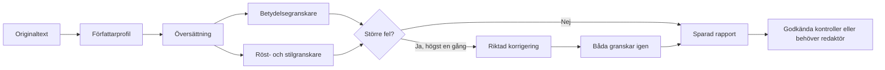

# Översättningskvalitet — första leveransen

Det första steget mot Verkli som en AI-produkt med kontrollerbar kvalitet är implementerat i grenen `codex/translation-quality-20260914`. Det är en översättningskedja med specialistgranskning och en panel för författaren. Ändringarna är lokala, inte driftsatta. Ingen ny dependency eller databasschemaändring ingår.

## Testa på localhost

[Öppna granskningspanelen](http://127.0.0.1:3024/dev/translation-quality). Den lokala sidan använder tydligt märkta exempel för att testa det riktiga gränssnittets tillstånd utan modellkostnader eller ändringar i manuskript. Produktionseditorn anropar API:t med författarens sparade text. Testsidan returnerar 404 i produktionsbygget.

1. Välj **Unresolved issue** och tryck **Review a sample**. Kontrollera laddning, låst knapp och att resultatet visar **Needs your attention**.
2. Öppna **The voice we are preserving**. Läs källcitat, översatt citat och förklaringen till den ändrade betydelsen. Ett underkänt resultat får inget godkännande.
3. Välj **Checks passed**, kör igen och kontrollera **Automated checks passed**. Detta betyder att granskarna inte hittade kvarvarande större fel, inte mänsklig kvalitetscertifiering.
4. Byt målspråk eller tryck **Refresh reports**. Det gamla provresultatet ska försvinna. Ändrad text kräver en ny granskning.
5. Välj **Provider unavailable** och kör igen. Ett tydligt fel ska visas utan godkänt resultat. Prova också på cirka 390 px skärmbredd och med tangentbord. Välj **Book job flow** för att testa den riktiga översättningspanelens knappar med förberedda köresultat: rapporten ska uppdateras först när jobbet är klart eller underkänt.
6. I en separat testmiljö med författarinloggning, Redis, Supabase och Anthropic: öppna en opublicerad testbok → Translate → granska ett prov → starta ett kapiteljobb. Kontrollera att rapporten dyker upp efter terminal köstatus och att allvarliga kvarvarande fel stoppar jobbet. Använd en kort påhittad text; detta steg anropar modeller och skriver testdata.

Automatiserad lokal UI-kontroll: `node apps/web/scripts/qa-translation-quality.cjs` från worktree-roten. Den använder installerad Chrome och testservern på port 3024.

## Vad som nu finns

- Profilen grundas i originalet: röst, rytm, dialog, avsiktliga egenheter och belagda termer. Bokjobb delar en profil från början, mitten och slutet.
- Översättning, betydelsegranskning och stilgranskning är separata modellanrop. Båda granskarna jämför med originalet. Stilgranskaren ska bevara upprepningar, fragment och särprägel; ingen opålitlig AI-textdetektor används.
- Modellens JSON-format styrs med schema och valideras även lokalt. Segmentantal, icke-tom text, granskningsomfattning, källcitat och riktade korrigeringar kontrolleras. Ofullständiga svar stoppas.
- Högst en korrigeringsrunda. Kvarvarande större fel eller otillgänglig granskning stoppar bokjobbets färdigmarkering. Rapporter, modell, rubricering och tillgänglig tokenförbrukning sparas i befintliga `ai_jobs`.
- Gamla målkapitel raderas inte före granskning. Alla kontrollerade kapitel förbereds först, därefter sparas de med befintliga kapitel-ID:n. Publicerade måleditioner måste först avpubliceras av författaren.
- Rapportens käll- och målhash jämförs med aktuell text. Ändringar gör rapporten inaktuell. Ett enskilt kapitel ger inte ett helt manuskript kvalitetsstatus.
- Prov och bokjobb använder daglig kostnadsbegränsning. Köomförsök delar reservation, medan en ny beställning får en ny reservation. Ett avbrutet betalt jobb återstartar inte automatiskt hela modellkedjan.

## Verifiering

- Hela testsviten: **182 testfiler, 1 930 tester godkända**. Inkluderar regressionsfall för behörighet, otillgänglig modell, felaktiga svar, begränsad korrigering, formatbevarande, kostnader, avbrutna jobb och bevarad äldre översättning.
- ESLint och produktionsbygge med Webpack godkända. Bygget inkluderar TypeScript-kontroll. Standardbygget med Turbopack stoppades av worktreens externa `node_modules`-symlänk; verifierat kommando är `npm run build -w @verkli/web -- --webpack`.
- UI-kontroll i Chrome: laddning, fynd, godkänt prov, fel, språkbyte, rapportuppdatering, tangentbord och mobilbredd. Lokal QA-route gav **404** i körande produktionsbygge.
- **Riktigt modelltest:** ett kort påhittat svenskt manuskript översattes till engelska genom profil → översättare → båda granskarna. Resultat: `checks_passed`, en granskningsrunda, ingen korrigering, 5 919 input- och 733 output-tokens. Detta bevisar att anropskedjan fungerar för provet; det är inget bokkvalitetsbenchmark.
- Hela kön → produktionsdatabasen → verkligt författarkonto har inte körts som sluttest. Inga kundmanuskript har använts i det riktiga modelltestet.

## Nästa steg före en premiumlansering

1. **Mät litterär kvalitet.** Bygg ett godkänt testbibliotek med flera författarröster, språkpar, dialog, idiom, avsiktlig repetition och formatering. Låt tvåspråkiga redaktörer blindbedöma betydelse, röst och redigeringsbehov före och efter granskning. Mät även fel som granskarna missar eller själva inför.
2. **Kalibrera driften och kör hela bokflödet i testmiljö.** Dagens konservativa reservation och standardbudget på 500 000 interna enheter medger exempelvis två kapitel à 4 000 tecken (368 752 enheter), men stoppar tre (549 792). Ett prov på 4 000 tecken reserverar cirka 175 540 enheter. Detta är reserverade interna säkerhetsenheter, inte verkligt pris. Bestäm tillåten kostnad, kapacitet och hantering av outnyttjad reservation före utrullning; budgetinställningen har inte höjts.
3. **Bygg författarens bestående minne.** Redigerbar termlista och stilprofil per bok, med konsekvenskontroll mellan kapitel och sparade redaktörsbeslut. Nuvarande delade profil ersätter inte en fullständig bokövergripande kontroll. Provets frivilliga stilinstruktioner gäller bara provet.
4. **Inför motsvarande ljudboks-QA.** Manusförberedelse och uttalslista → ljudgenerering → återtranskribering och jämförelse → kontroller av bortfall, upprepningar, pauser, klippning och röstkontinuitet → provlyssning och avgränsad omgenerering.
5. **Granska skrivassistenten och jämför modeller.** Två granskarroller på samma modell kan dela blinda fläckar. Benchmarken ska avgöra om en annan modell eller leverantör förbättrar kvaliteten. Den här leveransen använder befintlig Anthropic-integration, inte ett nytt OpenAI-byte.

Databassparandet över upsert, borttagning av överflödiga kapitel och slutstatus är inte en gemensam transaktion. Ett databasfel i sparfasen markeras som fel och får inget slutgodkännande. Senare samtidiga manusredigeringar upptäcks genom rapportens hash, men fullständig versionslåsning/atomisk publicering återstår. Språklig kvalitet kan inte garanteras av gröna kodtester.
